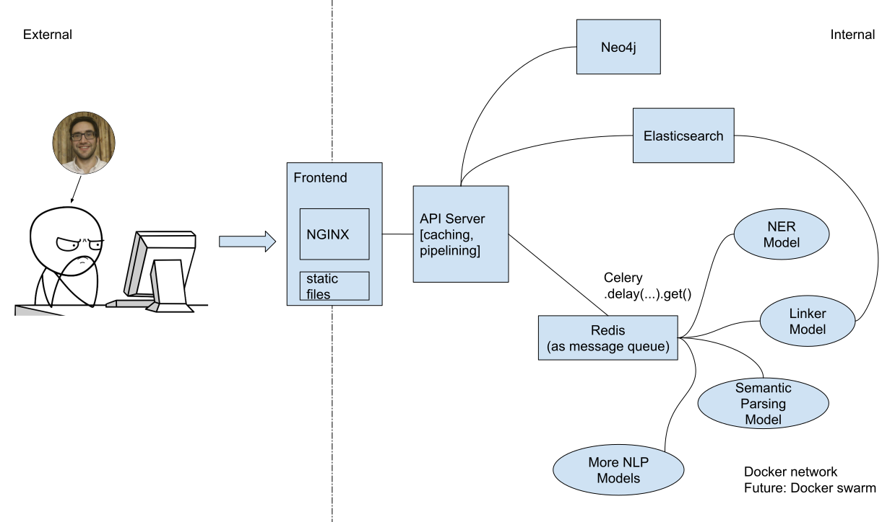

nlpworkbench
====

## What-Is
- [The purpose of this project](#about)
- [The layout of this project](#layout)
- [The call stack of an API call](#api-call-stack)
## How-To
- [Deploy the whole thing on a single machine](#deployment)
- [Add a new NLP tool](#extension)
- [Write and run tests](#testing)
- [Move some NLP tools to another machine](#distributed-deployment)
- [Backup and restore the workbench](#restoring-from-backups)

## About
Please refer to this paper:
```bibtex
@misc{yao2023nlpworkbench,
      title={NLP Workbench: Efficient and Extensible Integration of State-of-the-art Text Mining Tools}, 
      author={Peiran Yao and Matej Kosmajac and Abeer Waheed and Kostyantyn Guzhva and Natalie Hervieux and Denilson Barbosa},
      year={2023},
      eprint={2303.01410},
      archivePrefix={arXiv},
      primaryClass={cs.CL}
}
```

## Deployment
Docker is the preferred way of deployment.
Requires a newer docker and docker compose plugin. Tested with docker v20.10.16.

Clone the repositories and build docker images:
```bash
# build images
docker compose -f docker-compose.dev.yml --profile non-gpu --profile gpu build
# provide credentials
export BEARER_TOKEN=AAAAAAAAAAA # Twitter API bearer token
export ELASTIC_PASSWORD=elastic # Elasticsearch password, default is `elastic`
# run
docker compose -f docker-compose.dev.yml --profile non-gpu --profile gpu up
```

The workbench should be up and running on `http://localhost:8085`. Paste a news link in the input box and click "Load News" to run some tests.

Without further configurations some parts will not be working: Kibana needs to be paired with Elasticsearch. The entity linker will not work because the knowledge graph is empty. "Feelin' Lucky" also will not work because the article collection in ES is empty. But entity recognition, semantic parsing, and relation extraction should be working fine.

By default docker creates temporary volumes to store data. During production we want to persist things, and this is done by binding locations on the host to the containers. We also need to configure Neo4j and Kibana for pair with the servers. Details on deploying in production mode are documented [here](docs/deploy-production.md).
## Extension

The architecture of the nlpworkbench is shown in the above figure. Each NLP tool / model runs in its independent container, and communicates with the API server using Celery, or alternatively any protocol you like.

The goal of using Celery is that you can move any Python function to any physical machine and 
still use it as if it's running on the same machine, without worrying about (de)serialization, 
networking protocols, communication, etc. Celery will put all tasks into a queue, and starts workers that consumes tasks from the queue.

Let's start with a simple example to show how the Celery works. For example, we have a function that does tokenization:
```python
# callee.py
def tokenize(text):
    return text.split()
```
On the same machine, calling this function is as simple as:
```python
# caller.py
from callee import tokenize
tokens = tokenize("hello world")
```

Now, suppose we want our `tokenize()` function to run on another machine (or another container). We would create a Celery worker and register the function as a remote one, and run `python3 callee.py` to start the server.
```python
# callee.py
from rpc import create_celery

celery = create_celery("callee") # first arg is the filename

@celery.task
def tokenize(text):
    return text.split()

if __name__ == '__main__':
    # you can control the number of workers
    celery.start(argv=["worker", "-l", "INFO", "--concurrency=1", "-Q", "callee"])
```

On the caller's end, calling `delay()` on the function `tokenizer` can put the task in the queue, and calling `get()` will block and wait to get the result:
```python
# caller.py
from caller import tokenize

tokens = tokenize.delay("hello world").get()
```

That's it! Celery configured in `rpc.py` should work with any parameter / return data types, but it's encouraged to only use built-in types to avoid weird bugs. If you are not using this codebase, you can copy `rpc.py` to your repository. The only dependency to add is `dill==0.3.5` and `"celery[redis]"==5.2.7`.

**If running individual containers**, you need to have redis running and configure the redis address in `config.py`.

Finally, we can wrap the new tokenization tool in a container. Create a new file called `Dockerfile` in the folder:
```dockerfile
FROM python:3.7
WORKDIR /app
RUN pip install dill==0.3.5 "celery[redis]"==5.2.7
CMD ["python3", "callee.py"]
```
then add 
```yaml
  tokenizer:
    build:
      dockerfile: path-to-tokenizer/Dockerfile.ner
      context: path-to-tokenizer/
```
to the `services` section in `docker-compose.yml`

Sample configuration files can be found under `example/`.

## Distributed Deployment

### Manual deployment
Services in `docker-compose.yml` are labelled with two profiles: `gpu` and `non-gpu`. Running `docker compose [--profile non-gpu] [--profile gpu] up --build` will start the selected groups of containers. In our case we run the `non-gpu` group on `caidac` and `gpu` group on turin4.

Since we are using redis as the message queue, it is relatively easy to move worker containers to other machines, as long as redis is exposed to the public network. **CAVEAT: set a long password for redis `--requirepass` if exposing to public, and configure firewall to only allow desired hosts.** Configure `RPC_BROKER` and `RPC_BACKEND` in the environment to be the public address of the redis server.

### Using Docker Swarm
Once we have GPU servers, we might want to move some of the NLP models there. It's possible to run containers on different physical machines with the help of `docker swarm`. Read the official tutorial here: [https://docs.docker.com/engine/swarm/](https://docs.docker.com/engine/swarm/).

In a nutshell, these things need to be done:  

1. On one of the machines, use `docker swarm init` to create a swarm manager.
2. On other machines, use `docker swarm join --TOKEN MANAGER_IP` to join the swarm.
3. Use `docker node update --label-add foo --label-add bar=baz node-1` to add labels to the nodes.
4. Combine labels and placement constraints to control what container goes to which node.
5. Run `docker stack deploy -c stack.yml nlpworkbench`.

Local containers should be stored in a local registry:
```
docker service create --name registry --publish published=5000,target=5000 --constraint node.hostname==caidac registry:2 

docker compose -f stack.yml build
docker compose -f stack.yml push

docker stack deploy --compose-file stack.yml nlpworkbench
```

## Indexing model outputs
If using explicit mapping, the following mappings are used for caching model outputs:
```
PUT /bloomberg-reuters-v1/_mapping
{
  "properties": {
    "raw-ner-output": {
      "type": "object",
      "enabled": false
    }
  }
}

PUT /bloomberg-reuters-v1/_mapping
{
  "properties": {
    "raw-linker-output": {
      "type": "object",
      "enabled": false
    }
  }
}

PUT /bloomberg-reuters-v1/_mapping
{
  "properties": {
    "raw-amr-output": {
      "type": "object",
      "enabled": false
    }
  }
}

PUT /bloomberg-reuters-v1/_mapping
{
  "properties": {
    "raw-person-rel-output": {
      "type": "object",
      "enabled": false
    }
  }
}
```

Some fields, like `raw-amr-output`, are not indexed (`"enabled": false`).

## Restoring from backups
### Elasticsearch
1. Add `- path.repo=/repo` to `services->elasticsearch->environments` in `docker-compose.yml`. Mount the folder containing snapshots to `/repo` of the ES container. Uncompress previous snapshots there (for example, `/path/to/repo/bak` contains the snapshots and `/repo` in the container is mapped to `/path/to/repo/bak`).
2. In Kibana -> Management -> Stack Management -> Snapshot and Restore, register a new **Shared file system** repository with path `bak/` (as in the example).
3. You will then see and be able to restore the snapshot in Kibana.

### Neo4j
`neo4j.dump` must be readable by user `7474:7474`.

Create a new container:
```bash
docker run -it --rm \
  --volume=/home/ubuntu/workbench/docker-data/neo4j:/data \
  --volume=/home/ubuntu/workbench/docker-data/neo4j.dump:/neo4j.dump \
  neo4j:4.4-community \
  bash -c "neo4j-admin load --from=/neo4j.dump --force --verbose"
```

**neo4j image version must match dump version and dbms version!!**

## API Call Stack
This [diagram](docs/callstack.pdf) shows what's happening behind the scene when an API call is made to run NER on a document.

When a REST API is called, the NGINX reverse proxy (running in `frontend` container) decrypts the HTTPS request, and passes it to the `api` container. Inside the `api` container, `gunicorn` passes the request to one of the Flask server processes. Numbers below correspond to labels in the diagram.

1. `wsgi.py` provides routing for RESTful API calls. Everything under `doc_api.route` is registered with a pre-request hook.
2. The pre-request hook verifies and loads document from the ES collection. The document is stored in Flask's global object `g` for the lifecycle of the request.
3. Loading document is handled by `api_impl.py`, which makes a request to Elasticsearch to retrieve the document if the document in a collection, or downloads the article from the URL provided.
4. An Elasticsearch query is just an HTTP request.
5. After the document is retrieved, `get_ner` in `api_impl.py` is called. `api_impl.py` provides real implementation of the functions, and caching of results. Functions in `api_impl.py` are wrapped with `@es_cache` decorator which handles caching.
6. The `es_cache` decorator creates a cache key based on the parameters of the function call, and checks if the result is already cached. If so no real computation is done and the cached result is returned.
7. If no NER output is cached, we use celery to call the remote function `run_ner` running in `ner` container.
8. The `run_ner` function prepares the input for the PURE NER model. The open source code from PURE takes json line text files as input and writes to another json line file. `run_ner` prepares the input files, calls the NER model, and parses the outputs. 
9. `call` function is a wrapper in PURE NER's code base. PURE NER initially can only be called via command line (handled in `__main__`) and this wrapper function pretends inputs are from the command line.
10. We also have lazy loading helper functions so that models are only loaded once.
11. Output of PURE NER is automatically stored in Elasticsearch by the `es_cache` decorator.
12. NER output is formatted to suit the need of the frontend, and responded to the user.

## Layout
```
build/
 |
 |-- Dockerfile.api
 |-- Dockerfile.service
frontend/
requirements/
 |
 |-- api.txt
 |-- service.txt
workbench/
 |
 |-- __init__.py
 |-- rpc.py
 |-- snc/
      |
      |-- __init__.py
 |-- thirdparty/
      | -- amrbart/
      | -- pure-ner/
docker-compose.yml
```

`build/` folder contains all `Dockerfile`s and `requirements/` folder contains `requirements.txt` for each micro-service.

`workbench/` contains all Python code. The folder and all of its subfolders (except `thirdparty/`) are [Python packages](https://docs.python.org/3/tutorial/modules.html#packages). A `__init__.py` file must be present in every subfolder. [Relative imports](https://docs.python.org/3/tutorial/modules.html#intra-package-references) (`from . import config`, or `from ..rpc import create_celery`) are the preferred way to reference modules within the `workbench` package.

## Testing
We are moving towards test-driven development. The infrastructure for unit tests are available.te

### Writing unit tests
We use the [pytest](https://docs.pytest.org/en/7.2.x/) framework to test Python code. It is a very light-weight framework: to write tests one would create a file `tests/test_some_module.py` containing functions with name `test_some_feature` and writing `assert` statements.

Here's a snippet from `tests/test_sentiment.py` that tests the VADER sentiment analyzer:
```python
from workbench import vader

def test_classify_positive_sents():
    positive_sents = [
        "I love this product.",
        "Fantastic!",
        "I am so happy.",
        "This is a great movie."
    ]
    for sent in positive_sents:
        output = vader.run_vader(sent)
        assert output["polarity_compound"] > 0.3
```

Running `python3 -m pytest tests/test_sentiments.py` will provide a report for this set of unit tests like:
```
==================== test session starts ==================== 
platform linux -- Python 3.9.12, pytest-7.1.1, pluggy-1.0.0
rootdir: /data/local/workbench-dev, configfile: pyproject.toml
plugins: anyio-3.5.0
collected 3 items                                                                            

tests/test_sentiment.py ...                                                            [100%]
============== 3 passed, 3 warnings in 0.37s ==============
```

In the real world we don't directly run code, and instead we use Docker. Unit test is added into a docker image separate from the image used to run the service, by using [multi-stage build](https://docs.docker.com/language/java/run-tests/). Still using VADER as the example, the Dockerfile after adding tests becomes:
```Dockerfile
FROM python:3.7 AS base
WORKDIR /app
RUN mkdir /app/cache && mkdir /app/vader_log && mkdir /app/lightning_logs
COPY requirements/vader.txt requirements.txt
RUN --mount=type=cache,target=/root/.cache/pip \
    pip3 install -r requirements.txt
COPY workbench/ ./workbench
ENV PYTHONUNBUFFERED=TRUE

FROM base as prod
CMD ["python3", "-m", "workbench.vader"]

FROM base as test
COPY .coveragerc ./
RUN --mount=type=cache,target=/root/.cache/pip \
    pip3 install pytest==7.2 coverage==7.0.5
COPY tests ./tests
CMD ["coverage", "run", "--data-file=cov/.coverage", "--source=workbench/", "--module", "pytest", "tests/test_sentiment.py"]
```
The `base` image contains all the source code and dependencies to run VADER. The `prod` image starts the process that serves VADER. The `test` image is used to run testing, where tests are added and test frameworks are installed. Running a container with the `test` image will invoke the tests.

After adding multi-stage build, `docker-compose.dev.yml` needs to be changed to specify the default build stage as `prod`:
```yaml
  vader:
    build:
      dockerfile: ./build/Dockerfile.vader
      target: ${COMPOSE_TARGET:-prod}
```

### Run tests locally
`run-test.sh` provides the scripts to run tests on your local machine using Docker. To test VADER:
```bash
./run-test.sh build vader # build the `test` stage image for vader
./run-test.sh test vader # run a container with the `test` image
# repeat the process for other services. 
# `vader` can be replaced with other services defined in `docker-compose.dev.yml`
./run-test.sh coverage # combine coverage info from all tests and print coverage report
```
