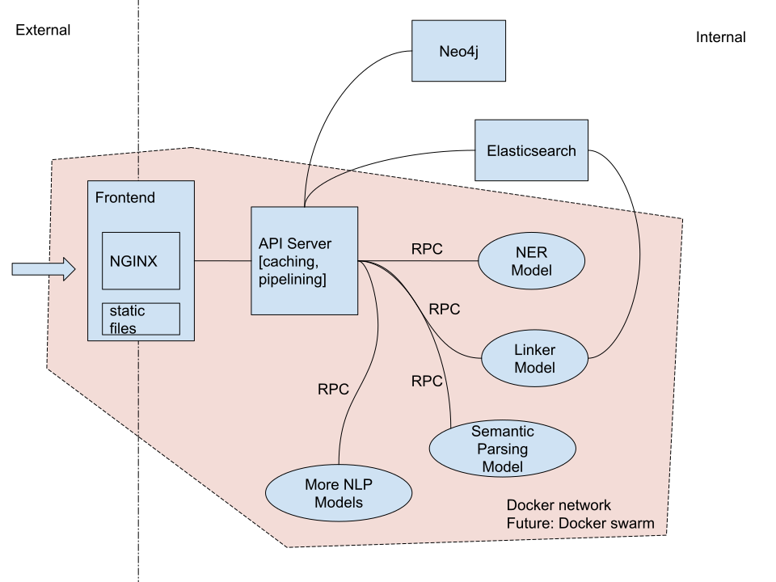

nlpworkbench
====

## How-To
- [Deploy the whole thing on a single machine](#deployment)
- [Add a new NLP tool](#extension)
- [Move some NLP tools to another machine](#distributed-deployment)
- [Backup and restore the workbench](#restoring-from-backups)

## Deployment
Docker is the preferred way of deployment.
### Docker
Requires a newer docker and docker compose plugin. Tested with docker v20.10.16.

On the host machine, prepare the folders for persisting data
```bash
mkdir /path/to/neo4j/data  # folder for storing neo4j data
mkdir /path/to/es/data  # folder for storing elasticsearch data
mkdir /path/to/sqlite/data  # folder for storing embeddings
touch /path/to/sqlite/data/embeddings.sqlite3 # database file for storing embeddings

mkdir -p /path/to/neo4j/certs/bolt/ # folder for storing neo4j certificates
cp /path/to/privkey.pem /path/to/neo4j/certs/bolt/private.key
cp /path/to/fullchain.pem /path/to/neo4j/certs/bolt/public.crt
cp /path/to/fullchain.pem /path/to/neo4j/certs/bolt/trusted/public.crt

# change permission to writable
chmod a+rwx /path/to/neo4j/data
chmod a+rwx /path/to/es/data
chmod a+rwx /path/to/sqlite/data/embeddings.sqlite3

chown -R 7474:7474 /path/to/neo4j/certs/
# change permissions of neo4j certificates following https://neo4j.com/docs/operations-manual/current/security/ssl-framework/#ssl-bolt-config
# just for example,
chmod 0755 /path/to/neo4j/certs/bolt/private.key
```

Modify `docker-compose.yml` file to mount the volumes to the correct locations (the folders you created above). Search for `volumes:` or `# CHANGE THIS` in `docker-compose.yml` and replace `source: ` with the correct path.

Follow this [document](https://www.elastic.co/guide/en/kibana/current/docker.html) to set elasticsearch passwords and generate enrollment tokens for kibana.
```bash
# set password for user elastic
docker exec -it nlp-workbench-elasticsearch-1 /usr/share/elasticsearch/bin/elasticsearch-reset-password -u elastic -i
# set password for user kibana_system
docker exec -it nlp-workbench-elasticsearch-1 /usr/share/elasticsearch/bin/elasticsearch-reset-password -u kibana_system -i
# generate an enrollment token for kibana
docker exec -it nlp-workbench-elasticsearch-1 /usr/share/elasticsearch/bin/elasticsearch-create-enrollment-token -s kibana
```
Open kibana in a browser and use the enrollment token to set up kibana.


Modify the port mapping in `docker-compose.yml` file under `services -> frontend -> ports` to change the exposed port. The current one is 8080, which means `http://localhost:8080` is the url for the workbench.

Clone the repositories and build docker images:
```bash
# clone thirdparty nlp tools and frontend
git submodule init
git submodule update
# build images
docker compose --profile non-gpu --profile gpu build
# run
docker compose --profile non-gpu --profile gpu up
```

Finally, run some quick tests. The entity linker will not work because the knowledge graph is empty. "Feelin' Lucky" also will not work because the article collection in ES is empty. But entity recognition, semantic parsing, and relation extraction should be working fine.

Paste a news link in the input box and click "Load News" to run some tests.

### Manual deployment
You shouldn't need to deploy things manually. The docker service does all the steps here.

#### Run a development server
Create a new virtual environment and run `pip3 install -r requirements-api.txt`

Use `flask run --host=127.0.0.1 --port=3000` to start a development server.

#### Deploy API server for production
1. Install nginx, and configure SSL certificates (probably with let's encrypt).
2. Put `confs/nginx-conf` in `/etc/nginx/sites-enabled/`. You can do this by `ln -s confs/nginx-conf /etc/nginx/sites-enabled/nlpworkbench-backend`
3. Run `sudo nginx -s reload` to load the site configuration.
4. Put `confs/demo-api.service` in `/etc/systemd/system/`. You can do this by `ln -s confs/demo-api.service /etc/systemd/system/demo-api.service`.
5. Run `sudo systemd daemon-reload` to load the service configuration.
6. Run `sudo systemd start demo-api` to start the backend.

#### Setting up components
##### Article DB
Articles are stored and indexed in Elasticsearch. After setting up Elasticsearch, modify config.py and point `es_url` and `es_auth` to the es server, and change `es_article_collection` to the collection name.

##### Named entity recognition
Download the pre-trained model from [https://nlp.cs.princeton.edu/projects/pure/ace05_models/ent-bert-ctx300.zip](https://nlp.cs.princeton.edu/projects/pure/ace05_models/ent-bert-ctx300.zip) and decompress it.

Clone the NER system from `git@gitlab.com:UAlberta/nlpwokkbench/pure-ner.git`.

In `config.py`, point `ner_script` to `run_ner.py` in the PURE NER repository, and `ner_model` to the model folder.

##### Entity linking
Entities are indexed in elasticsearch by their aliases. Point `es_entity_collection` to the entity collection in ES.

After generating candidates from a ES query, our system rescores all candidates by comparing sentence embeddings. For this we'll need pre-computed embeddings for all the entities (stored in an sqlite db, [download here](https://drive.google.com/file/d/17cvpeiwifVMBJ-Sidqq_f-pskvyyAlhv/view?usp=sharing)). Change `embeddings_db` in `config.py` to the sqlite file.

Neo4j stores entity attributes and descriptions. Set `neo4j_url` and `neo4j_auth` properly.

##### Semantic parsing
Clone `git@gitlab.com:UAlberta/nlpwokkbench/amrbart.git`

Download the pre-trained model by running
```bash
# apt install git-lfs
git lfs install
git clone https://huggingface.co/xfbai/AMRBART-large-finetuned-AMR3.0-AMR2Text
```

Point `amr_script` to `inference_amr.py` in the AMRBART repository, and set `amr_model` properly.

## Extension

The architecture of the nlpworkbench is shown in the above figure. Each NLP tool / model runs in its independent container, and communicates with the API server using Celery, or alternatively any protocol you like.

The goal of using Celery is that you can move any Python function to any physical machine and 
still use it as if it's running on the same machine, without worrying about (de)serialization, 
networking protocols, communication, etc. Celery will put all tasks into a queue, and starts workers that consumes tasks from the queue.

Let's start with a simple example to show how the Celery works. For example, we have a function that does tokenization:
```python
# callee.py
def tokenize(text):
    return text.split()
```
On the same machine, calling this function is as simple as:
```python
# caller.py
from callee import tokenize
tokens = tokenize("hello world")
```

Now, suppose we want our `tokenize()` function to run on another machine (or another container). We would create a Celery worker and register the function as a remote one, and run `python3 callee.py` to start the server.
```python
# callee.py
from rpc import create_celery

celery = create_celery("callee") # first arg is the filename

@celery.task
def tokenize(text):
    return text.split()

if __name__ == '__main__':
    # you can control the number of workers
    celery.start(argv=["worker", "-l", "INFO", "--concurrency=1", "-Q", "callee"])
```

On the caller's end, calling `delay()` on the function `tokenizer` can put the task in the queue, and calling `get()` will block and wait to get the result:
```python
# caller.py
from caller import tokenize

tokens = tokenize.delay("hello world").get()
```

That's it! Celery configured in `rpc.py` should work with any parameter / return data types, but it's encouraged to only use built-in types to avoid weird bugs. If you are not using this codebase, you can copy `rpc.py` to your repository. The only dependency to add is `dill==0.3.5` and `"celery[redis]"==5.2.7`.

**If running individual containers**, you need to have redis running and configure the redis address in `config.py`.

Finally, we can wrap the new tokenization tool in a container. Create a new file called `Dockerfile` in the folder:
```dockerfile
FROM python:3.7
WORKDIR /app
RUN pip install dill==0.3.5 "celery[redis]"==5.2.7
CMD ["python3", "callee.py"]
```
then add 
```yaml
  tokenizer:
    build:
      dockerfile: path-to-tokenizer/Dockerfile.ner
      context: path-to-tokenizer/
```
to the `services` section in `docker-compose.yml`

Sample configuration files can be found under `example/`.

## Distributed Deployment

### Manual deployment
Services in `docker-compose.yml` are labelled with two profiles: `gpu` and `non-gpu`. Running `docker compose [--profile non-gpu] [--profile gpu] up --build` will start the selected groups of containers. In our case we run the `non-gpu` group on `caidac` and `gpu` group on turin4.

Since we are using redis as the message queue, it is relatively easy to move worker containers to other machines, as long as redis is exposed to the public network. **CAVEAT: set a long password for redis `--requirepass` if exposing to public, and configure firewall to only allow desired hosts.** Configure `RPC_BROKER` and `RPC_BACKEND` in the environment to be the public address of the redis server.

### Using Docker Swarm
Once we have GPU servers, we might want to move some of the NLP models there. It's possible to run containers on different physical machines with the help of `docker swarm`. Read the official tutorial here: [https://docs.docker.com/engine/swarm/](https://docs.docker.com/engine/swarm/).

In a nutshell, these things need to be done:  

1. On one of the machines, use `docker swarm init` to create a swarm manager.
2. On other machines, use `docker swarm join --TOKEN MANAGER_IP` to join the swarm.
3. Use `docker node update --label-add foo --label-add bar=baz node-1` to add labels to the nodes.
4. Combine labels and placement constraints to control what container goes to which node.
5. Run `docker stack deploy -c stack.yml nlpworkbench`.

Local containers should be stored in a local registry:
```
docker service create --name registry --publish published=5000,target=5000 --constraint node.hostname==caidac registry:2 

docker compose -f stack.yml build
docker compose -f stack.yml push

docker stack deploy --compose-file stack.yml nlpworkbench
```

## Indexing model outputs
If using explicit mapping, the following mappings are used for caching model outputs:
```
PUT /bloomberg-reuters-v1/_mapping
{
  "properties": {
    "raw-ner-output": {
      "type": "object",
      "enabled": false
    }
  }
}

PUT /bloomberg-reuters-v1/_mapping
{
  "properties": {
    "raw-linker-output": {
      "type": "object",
      "enabled": false
    }
  }
}

PUT /bloomberg-reuters-v1/_mapping
{
  "properties": {
    "raw-amr-output": {
      "type": "object",
      "enabled": false
    }
  }
}

PUT /bloomberg-reuters-v1/_mapping
{
  "properties": {
    "raw-person-rel-output": {
      "type": "object",
      "enabled": false
    }
  }
}
```

Some fields, like `raw-amr-output`, are not indexed (`"enabled": false`).

## Restoring from backups
### Elasticsearch
1. Add `- path.repo=/repo` to `services->elasticsearch->environments` in `docker-compose.yml`. Mount the folder containing snapshots to `/repo` of the ES container. Uncompress previous snapshots there (for example, `/path/to/repo/bak` contains the snapshots and `/repo` in the container is mapped to `/path/to/repo/bak`).
2. In Kibana -> Management -> Stack Management -> Snapshot and Restore, register a new **Shared file system** repository with path `bak/` (as in the example).
3. You will then see and be able to restore the snapshot in Kibana.

### Neo4j
`neo4j.dump` must be readable by user `7474:7474`.

Create a new container:
```bash
docker run -it --rm \
  --volume=/home/ubuntu/workbench/docker-data/neo4j:/data \
  --volume=/home/ubuntu/workbench/docker-data/neo4j.dump:/neo4j.dump \
  neo4j:4.4-community \
  bash -c "neo4j-admin load --from=/neo4j.dump --force --verbose"
```

**neo4j image version must match dump version and dbms version!!**